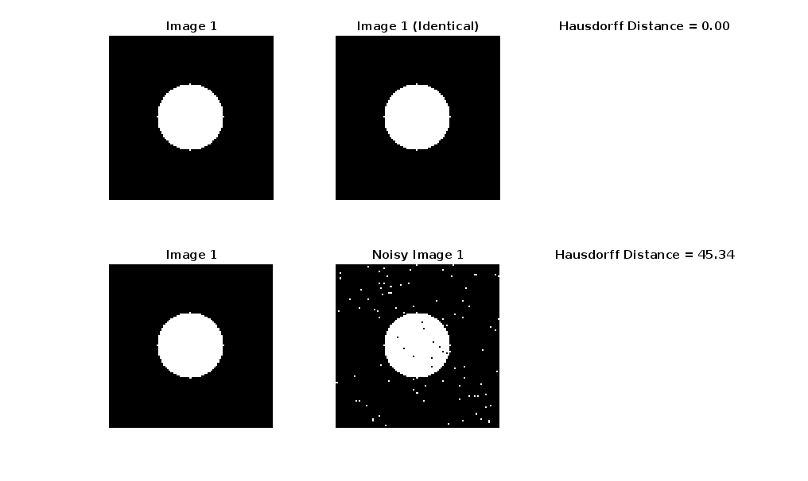

# Hausdorff Metric
This project implements the Hausdorff distance metric from scratch in MATLAB for comparing binary images. It is commonly used to evaluate the similarity between two shapes or contours in image processing and computer vision tasks.

## Author
Serge Alhalbi

## Company
Riverain Technologies

## Collaborators
- Jason Knapp  
- Xiaotian (Dennis) Wu

## Tools and Libraries
- MATLAB

## Usage
```bash
git clone https://github.com/SergeAlhalbi/hausdorff-metric.git
cd hausdorff-metric
```

## Results
Below are a few selected results:

- Original vs Noisy image **Hausdorff Distance**:
  

